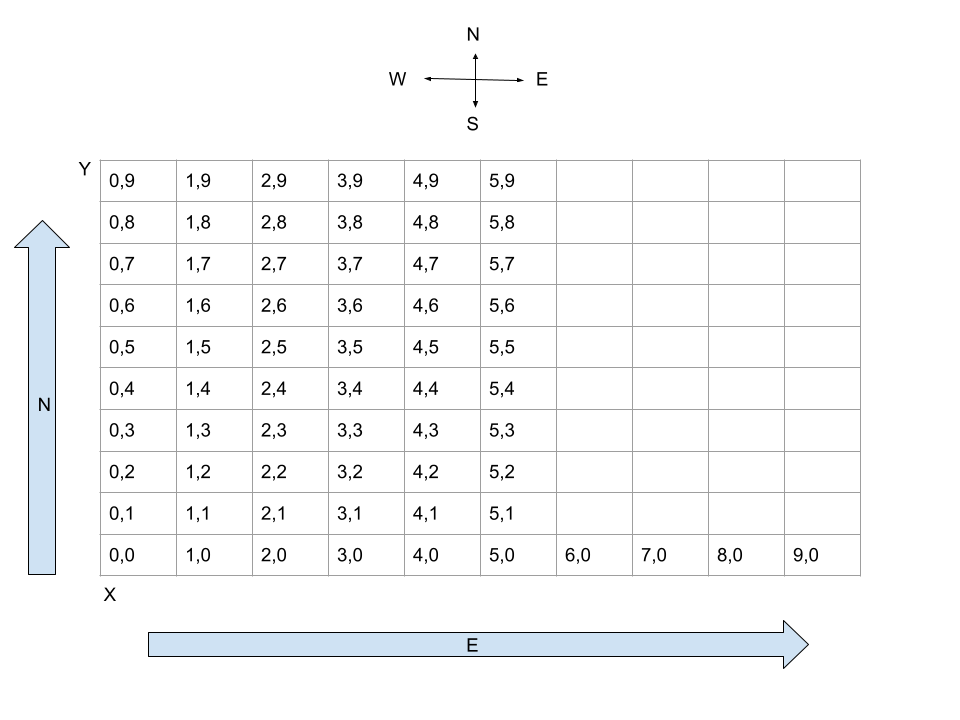

# Mars Rover

This is a kata from [KATALYST](https://katalyst.codurance.com/mars-rover)

The following diagram helped me out to understand better the coordinates that
the rover supposed to go and understand the kata.

